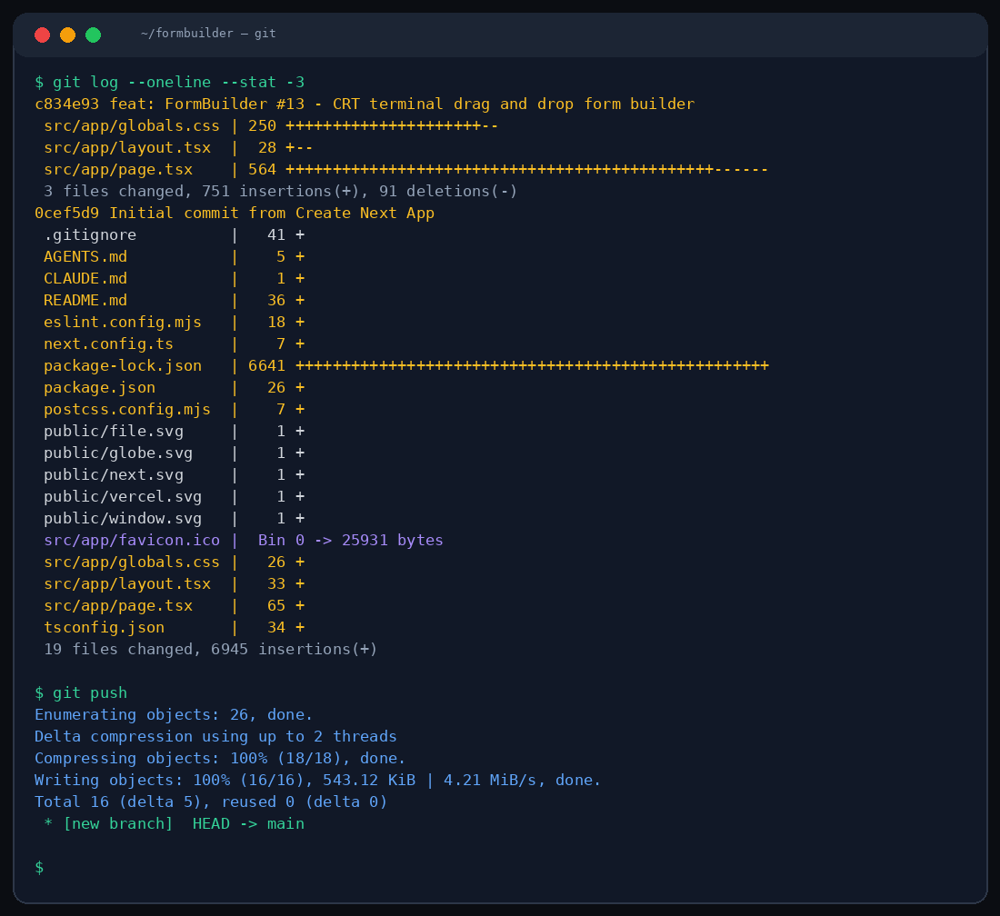

# ⚙️ FormBuilder

Drag. Drop. Ship. A retro CRT-styled form builder that lets you visually compose forms and export them as JSON schemas.



## What is this?

FormBuilder is a drag-and-drop form builder with a twist — it looks like an old-school CRT terminal. Green phosphor glow, scanline overlays, VT323 monospace font. The aesthetic is half the fun.

But it's not just looks. FormBuilder actually works:

**Drag fields from the palette → drop onto the canvas → configure properties → preview → export JSON.**

## Supported field types

| Type | Widget |
|------|--------|
| Text Input | Single-line text |
| Text Area | Multi-line text |
| Number | Numeric input |
| Email | Email validation |
| Password | Masked input |
| Dropdown | Select with options |
| Checkbox | Multiple choice |
| Radio Group | Single choice |
| Date Picker | Date selection |
| File Upload | File attachment |

## Three modes

- **[BUILD]** — Drag fields, configure labels, set validation rules
- **[PREVIEW]** — See your form as end users would, fill it out interactively
- **[JSON]** — View and export the form schema as clean JSON

## Run it

```bash
npm install
npm run dev
```

## Stack

Next.js 16 · TypeScript · Tailwind CSS 4 · MiMo v2.5 Pro

## Theme

CRT terminal aesthetic. Black (#0A0A0A) background, green phosphor text (#00FF41), amber accents (#FFB000), cyan highlights (#00FFFF). VT323 + Share Tech Mono fonts. Animated scanline overlay. Blinking cursor effects.

## Project

```
src/app/
├── page.tsx         ← form builder with 3-column layout
├── globals.css      ← CRT effects, scanlines, glow animations
└── layout.tsx       ← fonts + CRT overlay

src/components/      ← (if applicable)
```

---

*Crafted with MiMo v2.5 Pro* — powered by [Xiaomi MiMo](https://huggingface.co/XiaomiMiMo)

MIT
